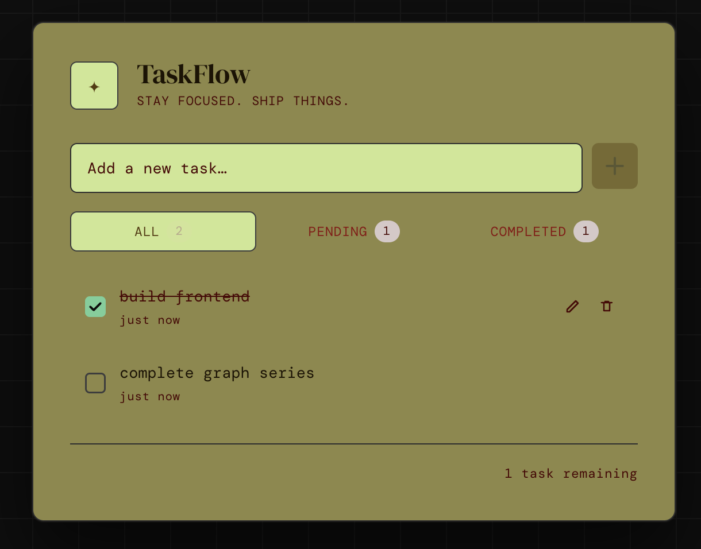

# ✦ TaskFlow

A clean, production-quality full-stack Task Manager built with React + Node.js/Express.



---

## Project Structure

```
taskflow/
├── backend/
│   ├── src/
│   │   ├── controllers/   # Request/response handling
│   │   ├── middleware/    # Error handler, 404
│   │   ├── routes/        # Express route definitions
│   │   ├── services/      # Business logic + in-memory store
│   │   ├── utils/         # Input validators
│   │   ├── __tests__/     # Jest + Supertest integration tests
│   │   └── server.js      # App entry point
│   ├── data/              # tasks.json (auto-created at runtime)
│   ├── Dockerfile
│   └── package.json
│
├── frontend/
│   ├── src/
│   │   ├── components/    # TaskForm, TaskList, TaskItem, FilterBar, ErrorBanner
│   │   ├── hooks/         # useTasks (state + API orchestration)
│   │   ├── services/      # taskApi.js (Axios service layer)
│   │   ├── utils/         # timeAgo, debounce
│   │   ├── App.js
│   │   └── App.css
│   ├── public/
│   ├── Dockerfile
│   └── package.json
│
├── docker-compose.yml
└── README.md
```

---

## Quick Start

### Option A — Local Development (recommended)

**Backend**
```bash
cd backend
npm install
npm run dev          # runs on http://localhost:3001
```

**Frontend** (separate terminal)
```bash
cd frontend
npm install
npm start            # runs on http://localhost:3000
```

### Option B — Docker Compose

```bash
docker-compose up --build
```

Frontend → http://localhost:3000  
Backend API → http://localhost:3001

---

## API Reference

Base URL: `http://localhost:3001/api`

All responses follow the shape:
```json
{ "success": true | false, "data": ..., "error": "..." }
```

### GET /tasks
Returns all tasks. Optionally filter by status.

**Query params:** `?filter=all|completed|pending`

```json
// Response 200
{
  "success": true,
  "data": [
    {
      "id": "f47ac10b-58cc-4372-a567-0e02b2c3d479",
      "title": "Implement auth flow",
      "completed": false,
      "createdAt": "2024-04-09T10:30:00.000Z"
    }
  ]
}
```

### POST /tasks
Create a new task.

```json
// Request body
{ "title": "Write unit tests" }

// Response 201
{
  "success": true,
  "data": {
    "id": "550e8400-e29b-41d4-a716-446655440000",
    "title": "Write unit tests",
    "completed": false,
    "createdAt": "2024-04-09T11:00:00.000Z"
  }
}

// Response 422 (validation failure)
{
  "success": false,
  "error": "Title cannot be empty."
}
```

### PATCH /tasks/:id
Update a task's title, completion status, or both.

```json
// Request body (one or both fields)
{ "completed": true }
{ "title": "Updated title" }

// Response 200
{
  "success": true,
  "data": { "id": "...", "title": "Updated title", "completed": true, "createdAt": "..." }
}
```

### DELETE /tasks/:id
Delete a task by ID.

```json
// Response 200
{ "success": true, "data": { "id": "550e8400-..." } }

// Response 404
{ "success": false, "error": "Task not found." }
```

### GET /health
```json
{ "success": true, "data": { "status": "ok", "timestamp": "..." } }
```

---

## Running Tests (Backend)

```bash
cd backend
npm test
```

Tests use **Jest** + **Supertest** and cover all four CRUD operations including validation edge cases.

---

## Features

| Feature | Status |
|---|---|
| Create / Read / Update / Delete tasks | ✅ |
| Mark tasks as completed | ✅ |
| Inline title editing (double-click or pencil icon) | ✅ |
| Filter: All / Pending / Completed | ✅ |
| Optimistic UI updates with rollback on error | ✅ |
| Relative timestamps ("3m ago") | ✅ |
| Loading skeletons | ✅ |
| Empty state per filter | ✅ |
| Form + inline validation | ✅ |
| Error banner with dismiss | ✅ |
| JSON file persistence (backend) | ✅ |
| UUID-based IDs | ✅ |
| Docker + docker-compose | ✅ |
| Backend unit/integration tests | ✅ |

---

## Assumptions & Trade-offs

- **In-memory store backed by JSON file** — tasks are loaded from `backend/data/tasks.json` on startup and written after every mutation. This is fast enough for a single-node app and makes the persistence layer easy to swap for a real database (just replace the service methods).
- **No authentication** — out of scope, but the modular structure makes adding JWT middleware straightforward.
- **Optimistic updates with rollback** — the UI applies changes immediately and reverts on API failure. This gives snappy feedback without a loading spinner on every click.
- **Filter on the backend** — passing the filter param to the API means the server does the work. The trade-off is a network call on each filter change; caching or client-side filtering could avoid this if performance became a concern.
- **No pagination** — acceptable for a task manager at this scale. A `limit`/`offset` query param could be added to the service layer with minimal changes.
- **CSS over Tailwind** — custom CSS gives full control over the editorial dark aesthetic without adding build tooling or PostCSS config.

---

## What I Would Improve With More Time

1. **Database** — Replace the JSON file with PostgreSQL via Prisma for proper transactions, migrations, and concurrent write safety.
2. **Auth** — Add JWT-based authentication so each user has their own task list.
3. **Drag-to-reorder** — Manual ordering via `react-beautiful-dnd` or similar.
4. **Due dates & priorities** — Extend the task model and add a date-picker and priority badge in the UI.
5. **Real-time sync** — WebSocket (Socket.io) or SSE to push updates across browser tabs.
6. **Frontend tests** — React Testing Library coverage for `useTasks`, `TaskForm`, and `TaskItem`.
7. **CI/CD pipeline** — GitHub Actions running lint + tests on every PR.
8. **Debounced inline editing** — Auto-save on type with a debounce, rather than on blur/Enter.
